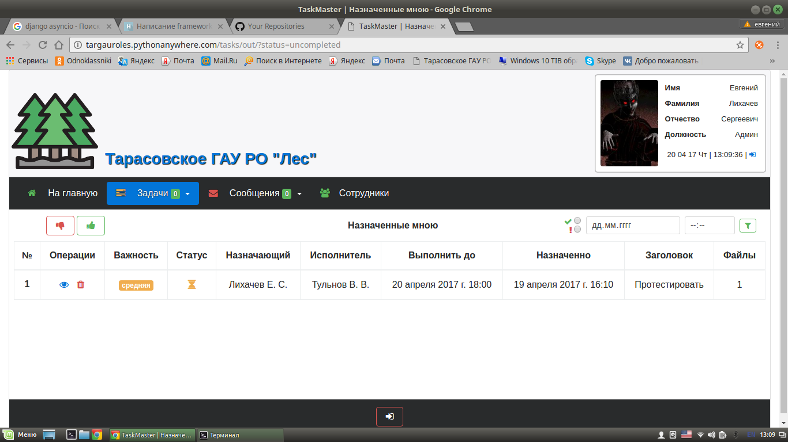

# Taskmaster
CRM-
приложение Taskmaster - это система позволяющая назначать задачи сотрудникам и отслеживать их выполнение.
- Задачи могут быть трех категорий важности, со сроками выполнения, так же к ним можно прикреплять файлы.
- Обычные пользователи могут назначать задачи кому-либо, переписыватся сообщениями.
- Уполномоченные пользователи могут как и назначать, так и удалять любые задачи, добавлять, редактировать и удалять пользователей,
а так же следить за общей статистикой выполнения задач, фильтровать их.

Демо:

http://targauroles.pythonanywhere.com

Username/Password: testuser/testuser

Инфо:

Бэк-энд: Python 3.5/ Django 1.10

Модули: requests,six, pillow

БД: SQLite

Фронт-энд: HTML5, CSS3, JS, JQuery, Tether, Bootstrap4, AwesomeFonts

